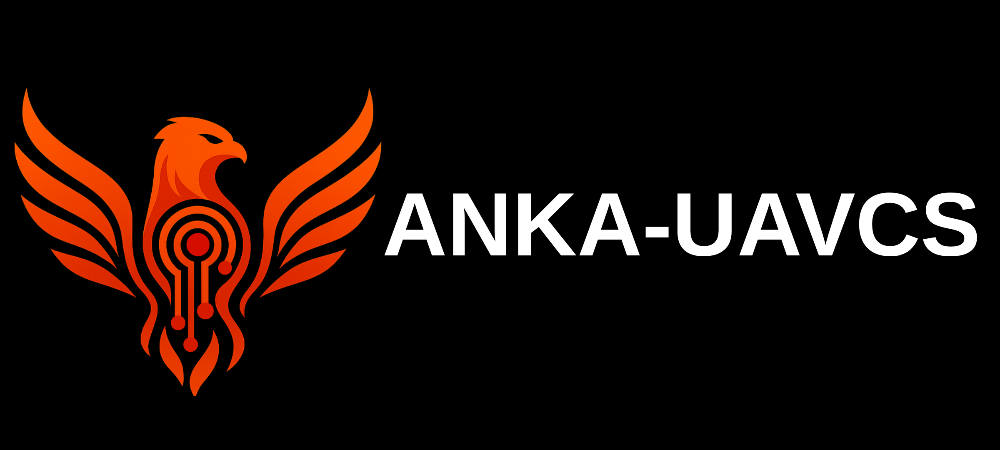
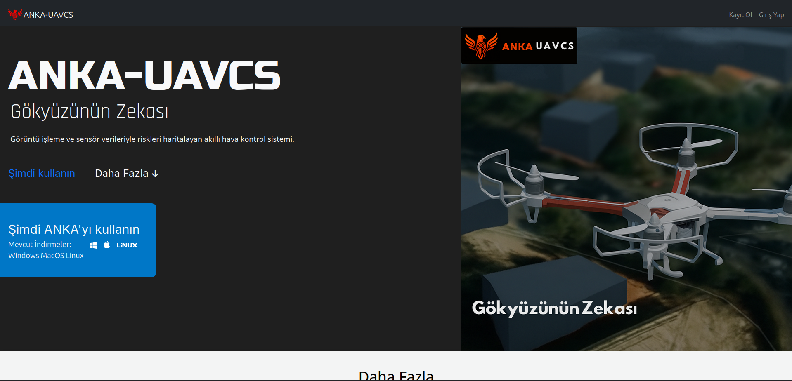
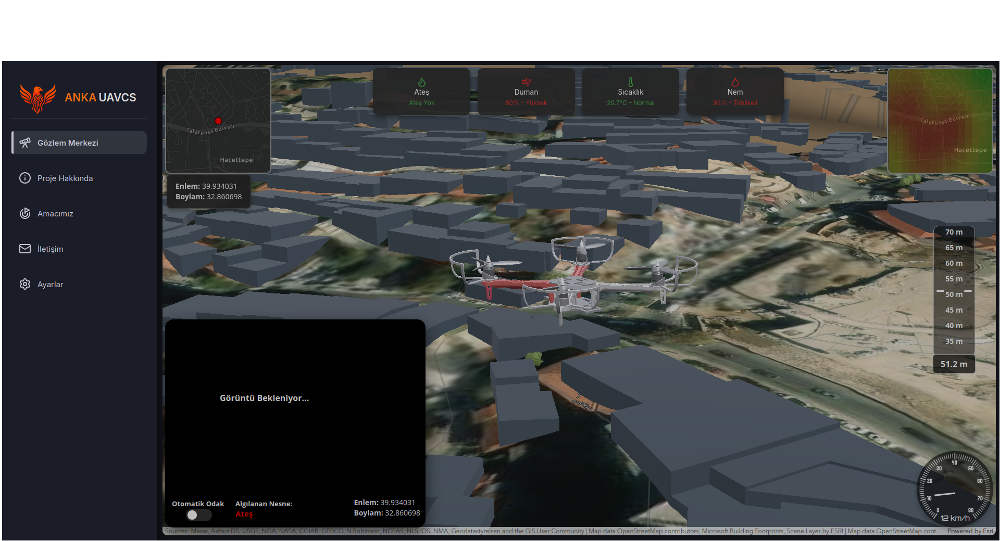

# ANKA-UAVCS



## Table of Contents
- [About ANKA-UAVCS](#about-anka-uavcs)
- [Installation and Usage](#installation-and-usage)
- [Tech Stack](#tech-stack)
- [Features](#features)
- [Screenshots](#screenshots)
- [System Overview](#system-overview)
- [Usage Examples](#usage-examples)
- [Future Improvements](#future-improvements)
- [Contributing](#contributing)
- [Contact](#contact)
- [Author](#author)
- [License](#license)

---
## About ANKA-UAVCS

**ANKA-UAVCS (Unmanned Aerial Vehicle Control System)** is a web-based command, monitoring, and analysis platform designed to integrate **real-time drone data**, **AI-powered image recognition**, and **3D geographic visualization** into a single interface.

Developed with **Python Flask** and **JavaScript**, ANKA-UAVCS enables operators to view live camera feeds, sensor outputs, and position data while dynamically mapping and analyzing risk zones using trained AI models such as **YOLOv8**.

The platform leverages **ArcGIS** and **Leaflet.js** for advanced 3D and spatial mapping, visualizing both terrain and structural data with layered precision. It combines elements of flight control, data science, and geospatial intelligence, creating a modular architecture suitable for both research and field applications.

The project aims to demonstrate how **AI and GIS** can enhance situational awareness, decision-making, and safety in UAV operations.

---
## Installation and Usage

To set up ANKA-UAVCS locally, ensure that **Python 3.9+** is installed.

1. **Upgrade pip** and install dependencies:
   ```bash
   python3 -m pip install --upgrade pip
   pip install -r requirements.txt
   ```

2. **Run the application**:
   ```bash
   flask run
   ```

3. **Access the web interface** at:
   ```
   http://localhost:5000
   ```

> **Note:** Depending on your environment, external API keys (e.g., ArcGIS) may need to be configured in the `.env` file.

---
## Tech Stack

- **Backend:** [Flask](https://flask.palletsprojects.com/)
- **Frontend:** HTML, CSS, JavaScript, [Bootstrap](https://getbootstrap.com)
- **Database:** [SQLite3](https://sqlite.org/)
- **AI Model:** [YOLOv8](https://github.com/ultralytics/ultralytics)
- **GIS Frameworks:** [ArcGIS API](https://developers.arcgis.com/javascript/latest/), [Leaflet.js](https://leafletjs.com/)

---
## Features

- **Real-Time UAV Interface** – Displays live camera feeds, GPS data, and telemetry.
- **AI-Powered Detection** – Identifies and highlights risk areas from drone imagery using YOLOv8.
- **3D Map Visualization** – Visualizes drone data and detections on interactive ArcGIS/Leaflet maps.
- **Data Logging** – Securely stores image and sensor data in SQLite3 for later analysis.
- **Modular Architecture** – Easily extendable backend and frontend for integration with new models or sensors.
- **Responsive Design** – Optimized for mobile and desktop control.

---
## Screenshots




---
## System Overview

ANKA-UAVCS is built on a modular architecture consisting of several key components:

- **Flask Backend:** Handles API requests, data storage, and AI model inference.
- **Frontend Interface:** Provides real-time dashboards for monitoring and control.
- **AI Engine:** Processes video streams using YOLOv8 to detect and classify regions of interest.
- **GIS Visualization:** Maps all detections and sensor readings in 3D for situational awareness.

---
## Usage Examples

- **Disaster Response:** Detect and map potential hazard zones from aerial footage.
- **Agricultural Analysis:** Identify crop health and anomalies via drone imagery.
- **Security Monitoring:** Detect unauthorized movement or high-risk zones in real time.
- **Research and Education:** Study how AI-driven UAV systems can enhance automation and mapping technologies.

---
## Future Improvements

- Integration with **real-time flight control and autopilot systems**
- Support for **multi-drone operations and swarm coordination**
- Implementation of **cloud-based storage and model synchronization**
- Development of **mobile application for remote access**
- Enhanced **AI models** for multi-class environmental detection

---
## Contributing

Contributions are welcome!
If you’d like to improve ANKA-UAVCS, fork the repository, create a branch, and submit a pull request.
Please ensure your changes are clearly documented and tested.
For major modifications, open an issue first to discuss your proposal.

---
## Contact

For bug reports, inquiries, or collaboration opportunities:
📩 **burakozyurt2010@gmail.com**

---
## Author

- [@Burak Özyurt](https://github.com/Burak-Ozyurt-17)

---
## License

This project is licensed under the **MIT License**. See [LICENSE](LICENSE) for details.
